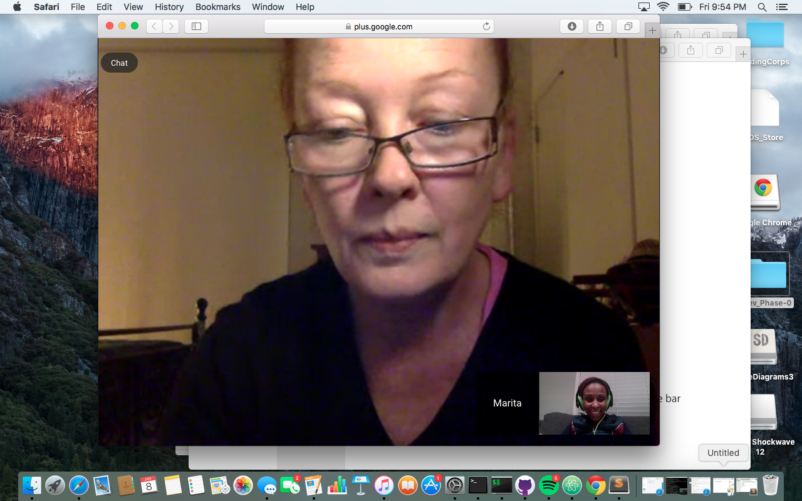

<!--*Mary had a little lamb
**It's fleece was white as snow
[Mary Had a Little Lamb Sister Act 2](https://www.youtube.com/watch?v=E4BYaRcYntQ)
\\
Program
6+5=x
x=3+8
what is x?
\\-->

Make something bold, italic, some sort of code block and a link (Links to an external site.). Also take a screenshot of you and your pair working on this challenge and display it inline. (You'll need to remember to upload it to the repository and link to it). Add and commit your changes for awesome_page.md, push your branch to GitHub.

*This text will be italic*
**This text will be bold**
[This is a link: Mary Had a Little Lamb Sister Act 2](https://www.youtube.com/watch?v=E4BYaRcYntQ)

`This is a codeblock`

